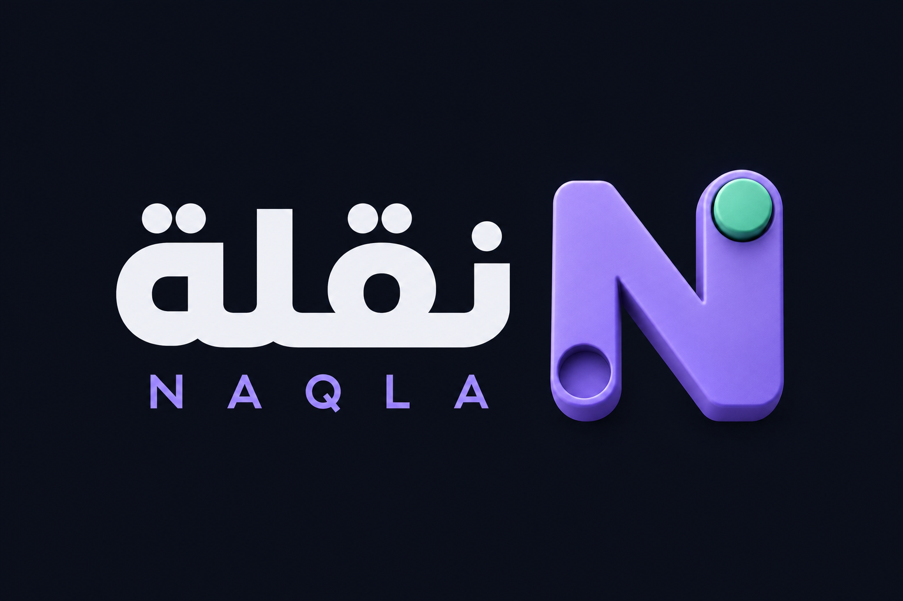

# نقلة — دليل التشغيل

<p align="center"></p>

منصة ألعاب استراتيجية قابلة للتشغيل بواجهة داكنة عربية وإنجليزية، وتضم حاليًا **ثماني ألعاب مسجلة**: أبالون، كوريدور، الداما، غوموكو، الطاحونة، أربع قطع متصلة، Digital Game، وReversi. منطق الألعاب مستقل عن الواجهة، ويستخدم التطبيق React وخادم Node.js وقاعدة SQLite وإعدادات Android وiOS عبر Capacitor.

## التشغيل على الكمبيوتر

ثبّت Node.js بالإصدار 24 أو أحدث، ثم نفّذ داخل مجلد المشروع:

```sh
npm ci
cp .env.example .env
npm run dev
```

افتح `http://localhost:5173`. يمكنك اللعب محليًا أو ضد الذكاء الاصطناعي دون إنشاء حساب. لتجربة اللعب الشبكي، افتح التطبيق في ملف متصفح آخر أو نافذة خاصة لإنشاء جلستين مختلفتين، ثم استخدم المطابقة أو الغرف الخاصة.

لبناء نسخة التشغيل:

```sh
npm test
npm run build
npm start
```

افتح بعدها `http://localhost:8787`. تُنشأ قاعدة البيانات داخل `data` تلقائيًا. مسار التحقق الآلي يشغّل تدقيق الحزم، واختبارات Node/React، وبناء الإنتاج، بينما تغطي Playwright الاستجابة للأبعاد واللمس والعربية/الإنجليزية ومتصفحات Chromium وFirefox وWebKit.

## ما يعمل

- أبالون: الحركة في ستة اتجاهات، المجموعات المتصلة، الحركة الجانبية، الدفع بالأغلبية، إخراج الكرات والفوز بإخراج ست كرات.
- كوريدور: حركة القطعة، القفز المستقيم والقطري بشروطه، الجدران ومعاينتها، منع التداخل والتقاطع، والتحقق من بقاء طريق لكلا اللاعبين.
- الداما الإنجليزية 8×8: الأخذ الإجباري والمتسلسل، ترقية الملك، الفوز بالأخذ أو الحصار، والتعادل بالتكرار أو 40 دورًا لكل لاعب دون تقدم.
- غوموكو الحرة 15×15: تأكيد وضع القطعة، والفوز بخمس قطع أو أكثر في أي اتجاه، والتعادل عند امتلاء اللوحة.
- الطاحونة (Nine Men’s Morris): وضع تسع قطع، التحريك، الطيران عند بقاء ثلاث قطع، تكوين الصفوف الثلاثية وحماية قطعها، والتعادل بالتكرار.
- أربع قطع متصلة (Connect Four): إسقاط القطع بالجاذبية على لوحة 7×6، ومنع الأعمدة الممتلئة، وفحص الفوز والتعادل.
- Digital Game: محرك القواعد الكلاسيكية للبلاطات الرقمية داخل المشروع، مع إخفاء رفوف الخصوم وتعدد اللاعبين وحالة شبكية يتحكم بها الخادم.
- Reversi على لوحة 8×8: وضع البداية القياسي بأربع قطع وبدء الأسود، قلب القطع المحاصرة في الاتجاهات الثمانية، التقاط متعدد الاتجاهات بالحركة نفسها، تمرير الدور تلقائيًا عند انعدام الحركة القانونية، وإنهاء المباراة عند امتلاء اللوحة أو تعذر الحركة على الطرفين ثم احتساب عدد القطع والتعادل.
- اللعب المحلي، مستويات الذكاء الاصطناعي المشتركة، المطابقة السريعة، الغرف الخاصة واللعب المصنّف عبر بنية الألعاب المشتركة. يتطلب اللعب المصنّف حسابًا مسجلًا، بينما يمكن للضيف اللعب العادي عبر الإنترنت.
- حساب ضيف أو بريد إلكتروني، الملف الشخصي، الإحصاءات، المفضلة، سجل المباريات، لوحات المتصدرين والأصدقاء.
- المؤقتات، التراجع في اللعب المحلي فقط، إعادة المباراة، الاستسلام، عرض التعادل، الرموز التعبيرية، النتائج، الصوت والاهتزاز وتقليل الحركة.
- خادم يتحقق من هوية اللاعب والدور والحركة والنتيجة والوقت، مع استعادة المباراة وحماية من تكرار الأوامر والتعديلات غير الموثوقة من العميل.

## تطبيق الهاتف

```sh
npm run mobile:android
npx cap open android
```

```sh
npm run mobile:ios
npx cap open ios
```

تنشئ السكربتات مشاريع Android وiOS عند الحاجة، ثم تبني أصول الويب وتزامن إضافات Capacitor وإعدادات الروابط العميقة. يحتاج Android إلى Java 21 وAndroid SDK، ويحتاج iOS إلى macOS وXcode والتوقيع المناسب.

للعب عبر الإنترنت من الهواتف، انشر الخادم ثم ضع عنوانه الآمن في `VITE_SERVER_URL` وأعد البناء. يوضح [دليل النشر](docs/DEPLOYMENT.md) الإعدادات، أسماء المتغيرات وخطوات ربط Google وApple.

## حدود التسليم الحالية

مستودع المشروع هو [3thelast-glitch/games](https://github.com/3thelast-glitch/games). الكود والبناء يخضعان للتحقق الآلي، لكن النشر العام وتوقيع تطبيقات المتاجر وتجربة الأجهزة الفعلية وإعداد Google/Apple الحقيقي تبقى خطوات خارجية.

LAN والشطرنج وMancala ما زالت إضافات مخططًا لها. **Reversi لم تعد Coming Soon؛ أصبحت لعبة مكتملة وقابلة للعب داخل المكتبة.** كما تبقى ميزات مثل التحقق من ملكية البريد واستعادة كلمة المرور وحذف الحساب والتنبيهات الخلفية ضمن أعمال المنتج المستقبلية.

التفاصيل في [حالة التسليم](docs/STATUS.md)، وبنية إضافة ألعاب جديدة في [دليل المعمارية](docs/ARCHITECTURE.md)، وتوثيق Reversi بالعربية في [docs/reversi.ar.md](docs/reversi.ar.md).
